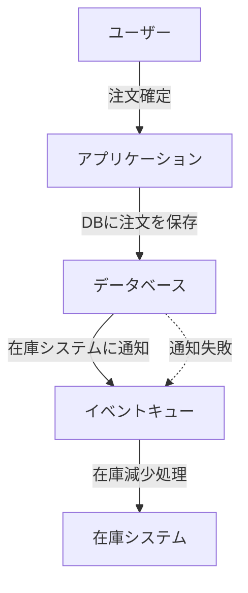
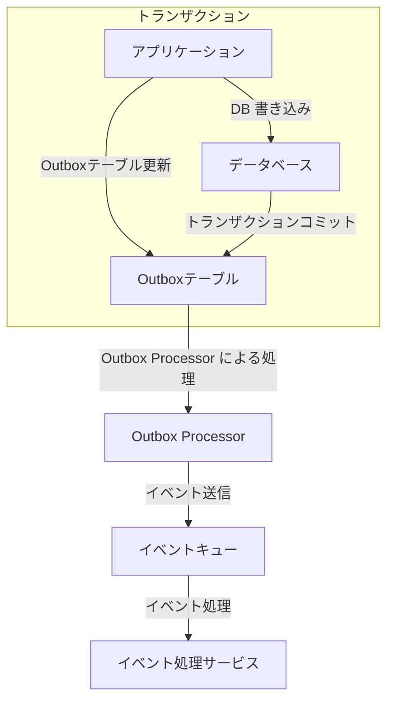

## 1. はじめに

### なぜこの技術を学ぶのか？

マイクロサービスアーキテクチャでは、複数のシステム間でのデータの一貫性を保つことが課題になります。特に、データベースへの書き込みと外部のキューやイベントシステムへの送信を同時に行う場合、トランザクションの管理が重要になります。Transactional Outbox はこの問題を解決するための設計パターンです。

### 知らなかったことで困ったこと

あるプロジェクトで、データベースの更新後に Kafka にイベントを送信する処理を実装した際、DB の書き込みは成功したものの、ネットワーク障害により Kafka への送信が失敗しました。このような場合、DB には変更が適用されているが、他のサービスには伝わっておらず、データの整合性が崩れる問題が発生しました。

### Transactional Outbox を学ぶメリット

- **DB とメッセージングシステムのトランザクションを統一的に管理できる**
- **データの一貫性を維持しながら、非同期処理を安全に行える**
- **分散システムにおけるデータの矛盾を減らせる**

## 2. Transactional Outbox とは？

### 送信箱（Outbox）の概念

Transactional Outbox は、通常のメールの「送信箱（Outbox）」のように、一時的に送信すべきメッセージを保管し、それを後で処理する仕組みです。これは、データベースへの書き込みとイベントの送信を**アトミックに保証できない** という課題を解決するために導入されます。

### 2つのシステムに書き込む際のトランザクションの課題

- **DB とイベントキューの更新を同時に行うと、アトミックな処理を保証できない**
- **外部サービスやキューへの通信は失敗する可能性があるため、データの整合性が崩れるリスクがある**

#### 例: 注文確定処理での課題



- **注文情報を DB に保存 → 在庫システムに通知**
- **イベント送信に失敗すると、在庫システムが注文を認識できず整合性が崩れる**

### Transactional Outbox の仕組みとトランザクションの課題の解決策



ポイントは次の3点です。

- **Outbox Table を活用し、DB の書き込みとイベント記録を同じトランザクションで行う**
- **Outbox Processor が定期的に Outbox テーブルを監視し、未処理のイベントを取得する**
- **イベントの送信に失敗しても、リトライ可能な仕組みを構築できる**

#### OutBox Transactional pattern の特徴

1. **アプリケーションがデータを更新**

   - 通常のデータテーブル（例: `orders`）にデータを保存する。
   - **同時に Outbox テーブルにもイベントを記録する。**

2. **トランザクションのコミット**

   - アプリケーションのデータと Outbox のデータを**同じトランザクションで確定**させる。

3. **Outbox Processor がポーリング（または CDC を利用）**

   - 一定間隔で Outbox テーブルをスキャンし、未処理のイベントを取得する。

4. **メッセージングシステムにイベントを送信**

   - SQS/Kafka などのメッセージングシステムに送信し、他のシステムと非同期に連携する。

5. **処理済みのイベントを削除**

   - イベントの送信が成功したら、Outbox テーブルから削除するか、`processed_at` フィールドを更新する。

## 3. どのように実装するのか？

### データベースの設計（Outbox テーブルのスキーマ）

```
CREATE TABLE outbox (
    id SERIAL PRIMARY KEY,
    event_type TEXT NOT NULL,
    payload JSONB NOT NULL,
    status TEXT CHECK (status IN ('PENDING', 'PROCESSED')) NOT NULL DEFAULT 'PENDING',
    created_at TIMESTAMP DEFAULT NOW()
);
```

### イベント通知の仕組み（ポーリング vs. CDC）

- **ポーリング**: 定期的に `PENDING` のレコードを取得して処理。
- **CDC（Change Data Capture）**: データベースの変更をリアルタイムで検知して処理。

### メッセージの送信（SQS, Kafka, SNS との連携）

適切なメッセージングシステムを選択し、冪等性を考慮した送信を行う。

### Outbox テーブルのデータ削除戦略

一定期間後に `PROCESSED` 状態のデータを削除し、テーブルサイズを抑制する。

## 4. 運用上の課題と解決策

### Outbox テーブルの肥大化 → 定期削除・アーカイブ戦略

Outbox テーブルは、送信されたイベントの記録を保持するため、時間が経つにつれてデータ量が増加し、クエリ性能が低下する可能性があります。

#### **解決策**

- **定期削除ジョブを実装する**
  - `PROCESSED` 状態のデータを一定期間（例: 7日間）保持した後に削除する。
  - 例: `DELETE FROM outbox WHERE status = 'PROCESSED' AND created_at < NOW() - INTERVAL '7 days';`
- **アーカイブテーブルに移動する**
  - `PROCESSED` のデータを別のテーブルやS3に保存し、本番テーブルのサイズを抑制。
- **パーティションテーブルを活用する**
  - 月単位のパーティションに分割し、古いパーティションを削除。

### イベントの二重送信 → Idempotency（冪等性）の担保

イベントが送信される際に、ネットワーク障害やプロセスのクラッシュなどにより、同じイベントが複数回処理される可能性があります。

#### **解決策**

- **イベントに一意な識別子（`event_id`）を付与する**
  - 受信側が `event_id` をチェックし、既に処理済みのイベントであれば無視する。
- **データベースにイベント処理ログを記録**
  - 処理済みイベントの `event_id` を保存し、重複処理を防ぐ。
- **Kafka の `enable.idempotence=true` を利用**
  - Kafka ではトランザクショナルプロデューサーを利用し、同じメッセージが重複送信されないようにする。

### ポーリングの負荷 → CDC（Change Data Capture）との比較

ポーリング（定期的にDBをチェックする方式）は、頻繁にクエリを実行するため、データベースの負荷が増加する。

#### **解決策**

- **ポーリング間隔を調整する**
  - 初期値は 1秒ごとにポーリングし、データ量に応じて適切な間隔を設定。
- **CDC（Change Data Capture）の活用**
  - RDBMS の場合、Debezium などの CDC ツールを使用し、変更をリアルタイムで検知。
  - DynamoDB の場合は DynamoDB Streams を利用し、変更をトリガーに処理を実行。

### 送信失敗時のリトライ → DLQ（デッドレターキュー）の活用

ネットワークエラーや一時的な障害によってイベントの送信に失敗した場合、適切なリトライ戦略が必要です。

#### **解決策**

- **指数バックオフリトライ**
  - 失敗時に 1秒 → 2秒 → 4秒 と徐々にリトライ間隔を長くする。
- **DLQ（デッドレターキュー）の導入**
  - 一定回数のリトライ後も失敗する場合、SQS の DLQ や Kafka の DLT に送信し、手動処理を行う。
- **リトライ可能なエラーと不可逆エラーを区別する**
  - ネットワーク障害ならリトライ、データ不整合なら DLQ に送るなどの戦略を設計。

### 送信遅延の問題 → ポーリング間隔の最適化

ポーリング方式では、DBの状態を定期的にチェックするため、リアルタイム性が低下する可能性があります。

#### **解決策**

- **リアルタイム性が必要な場合は CDC を検討**
  - RDBMS の binlog や DynamoDB Streams を活用。
- **ポーリング間隔を短縮するが、負荷を監視する**
  - DB の負荷が増えない範囲で最適なポーリング間隔を設定。

## 5. DynamoDB を使った場合の課題

### DynamoDB Streams でのイベント通知の違い

DynamoDB では、トランザクション内でイベントを Outbox テーブルに保存する代わりに、**DynamoDB Streams** を利用して変更を検知し、イベントを処理することが可能です。

- **メリット**
  - DB の書き込みとイベント通知の仕組みが統合される。
  - 別途 Outbox テーブルを管理する必要がない。
- **デメリット**
  - Streams のデータ保持期間は最大 24 時間。
  - シャード数が動的に変更されるため、負荷が高まると処理が遅延する可能性がある。

### ホットキー問題（特定のキーに負荷が集中する場合）

DynamoDB はパーティションキーを元にデータを分散するが、**特定のキーに書き込みが集中するとホットキー問題が発生し、スループットが制限される**。

#### **対策**

- **パーティションキーの設計を工夫する**
  - 例: `orderId` ではなく `orderId#shard-0`, `orderId#shard-1` のようにランダムな識別子を追加する。
- **GSI（グローバルセカンダリインデックス）の活用**
  - 読み込みの負荷を分散するために GSI を設計する。

### シャード数の増減とスケーリングの仕組み

DynamoDB Streams のシャード数は、**テーブルのパーティション数に基づいて決定される**。

- **パーティション数が増えるとシャード数も増加**
- **一定期間データの更新が少ない場合、シャード数は減少する**
- **大量の変更が発生すると、シャード数が増え処理能力が向上する**

#### **対策**

- シャード数の変動を考慮し、**Lambda の並列実行数を調整**
- シャードの分割が適切に行われるように、**アクセスパターンを分散**

### Kinesis Firehose によるバッチ処理の活用

DynamoDB Streams のデータは **Kinesis Firehose** を利用することで、S3 に保存し、バッチ処理することが可能。

#### **メリット**

- **長期間のデータ保持が可能**
- **リアルタイム処理の負荷を軽減**

#### **活用例**

- DynamoDB Streams → **Kinesis Firehose** → S3 → 後からバッチ処理
- DynamoDB Streams → **Lambda で SQS に送信** → 別のサービスで処理

## 6. まとめ & 学びの振り返り

### なぜ知っておくべきか？

- **分散システムではデータの整合性を保証する仕組みが重要**
- **Transactional Outbox によって、データベースとメッセージングの一貫性を保つことができる**

### 実践する際の注意点とベストプラクティス

- **冪等性を保証するための設計を考える（`event_id` などの利用）**
- **Outbox Table の肥大化を防ぐための削除戦略を導入する**
- **ポーリングの負荷を軽減するために CDC（Change Data Capture）を検討する**
- **DynamoDB を利用する場合は、ホットキーやシャードの変動に注意する**
