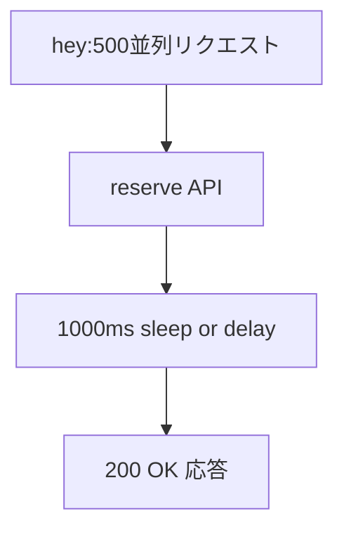

## はじめに

Spring Boot で REST API を開発する際、多くの場合 spring-web（＝サーブレットベース）を用いることが一般的です。私も普段はその方法で開発をしていましたが、先日ある API の負荷テストを行った際に、**思ったよりスループットが出ない**ことに気づきました。

その API は単純に 200ms の外部リクエストを待つだけのものでしたが、スレッド数の制約によりリクエスト処理にボトルネックが発生していたのです。実際の業務ロジックではさらに複雑な条件分岐や DB アクセス、複数の API 呼び出しが重なるため、レスポンスタイムはもっと長くなります。

そこで今回、Spring Boot で提供されているもう1つの選択肢である **Spring WebFlux** を使って、**非同期I/Oサーバーとの比較検証**を行ってみました。

## 実験の前提条件

今回の検証では、次の構成で API を実装しました。



- エンドポイント `/reserve` を用意
- 内部で `1000ms` の待ち時間を挟む（外部API相当）
- 同一ロジックを Servlet（Tomcat）版、WebFlux（Netty）版それぞれで実装
- 負荷テストツール [`hey`](https://github.com/rakyll/hey) を使って、同条件でベンチマークを取得

## Servlet (Tomcat) の結果

```sh
$ hey -n 1000 -c 500 -m POST http://localhost:8085/reserve
```

### 結果概要

- 平均応答時間：2.13秒
- 最大応答時間：3.09秒
- リクエスト/秒（RPS）：194
- 成功応答数：1000件

Tomcat の maxThreads デフォルト値（200）に対して、500並列リクエストを投げたため、スレッドが枯渇し一部のリクエストは待機列に入りました。結果として、RPSは200未満にとどまり、全体の応答時間が大きく延びています。

## Spring WebFlux (Netty) の結果

```sh
$ hey -n 1000 -c 500 -m POST http://localhost:8085/reserve
```

### 結果概要

- 平均応答時間：1.11秒
- 最大応答時間：1.31秒
- リクエスト/秒（RPS）：429
- 成功応答数：1000件

同じ処理を WebFlux で実装した場合、約2倍のスループットが得られました。イベントループによる非同期処理によって、スレッド枯渇が発生せず、ほぼ理論通りのレスポンスタイムとなっています。

## Servlet と WebFlux の処理モデルの違い

### Servlet（Tomcat）はスレッドベース

サーブレットベースのアプリケーションは、「**リクエスト1件につきスレッド1本**」という**スレッド・パー・リクエストモデル**で動作します。

- Tomcatのスレッド上限（例：200）を超えると、リクエストは待機キューに入り処理が遅延
- Thread.sleep() や DBアクセスなどのブロッキング操作がスレッドを占有
- 同時接続数が増えると急速に性能が劣化する

### WebFlux（Netty）はイベントループベース

一方、WebFlux（Netty）は**イベントループと非同期I/Oを基盤とした処理モデル**です。

- 少数のスレッドで多くのリクエストを切り替えながら処理
- Mono.delay() のように 非同期に「待つ」処理が可能
- スレッドをブロックせず、スケーラブルな高負荷処理に強い

## nginxとの類似性とモデル比較

「イベントループ」と聞いて思い出すのは nginx です。Nginx も `epoll` や `kqueue` といった OSレベルの非同期I/Oを活用し、少数のワーカープロセスで **大量同時接続（C10K問題）**を処理するために設計されたサーバーです。

WebFlux（Netty）もまさにこのモデルに近く、**Java 版 nginx 的な非同期処理モデル**といえます。

## goroutine／virtual threadとの比較

WebFluxと似たような概念として、Java の **Virtual Thread（仮想スレッド）** や Go の **goroutine**があります。 これらも大量の同時処理を可能にするモデルですが、WebFluxとは実行方式が異なります。

| 特性             | goroutine / Virtual Thread   | WebFlux / Nginx                  |
| ---------------- | ---------------------------- | -------------------------------- |
| 処理単位         | 軽量スレッド（M\:Nモデル）   | イベントループ + 非同期イベント  |
| ブロッキング許容 | ✅（sleep, I/O可）           | ❌（ブロッキング禁止）           |
| 書き方           | 同期コードでOK               | 非同期チェーン（Mono/Flux）      |
| 実行制御         | ランタイムがスケジューリング | イベントループがコールバック制御 |

### 結論：

- **Virtual Thread ≒ goroutine**：軽量スレッドでブロッキング処理も許容される
- **WebFlux ≒ nginx**：イベント駆動でノンブロッキングなI/Oモデル

## おわりに：WebFluxはServletの代替となるか？

WebFlux は優れたスケーラビリティを持ちますが、必ずしも Servlet の完全な上位互換ではありません。記述スタイルが非同期中心になることで、コードの見通しが悪くなったり、エラーハンドリングが複雑になることもあります。

| 適しているケース                    | モデル            |
| ----------------------------------- | ----------------- |
| 通常の業務Webアプリ（管理画面など） | Servlet（Tomcat） |
| 高同時接続／外部I/O待ちが多いAPI    | WebFlux（Netty）  |

開発するシステムの性質やチームの技術スタックに応じて、適切なアーキテクチャを選択していくことが重要です。
