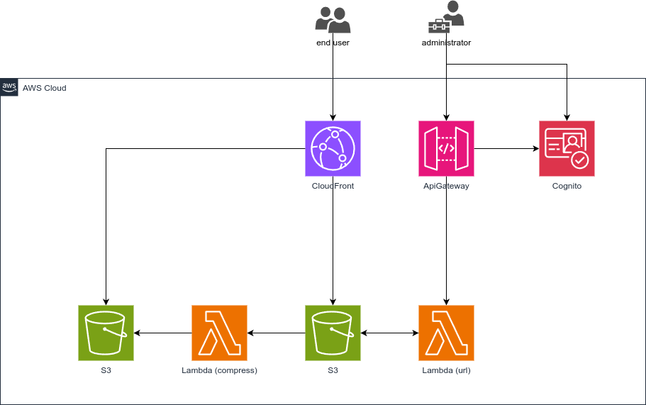

## 概要

ブログ用の写真をアップロードするにあたり、S3とCloudFrontを使って自分で写真をホストすることを検討した。

## 構成

写真アップロードシステムの機能と構成は以下となる。

- 署名付きURL発行:
  - 構成要素: API Gateway + Lambda + S3
  - 機能: LambdaがS3にアップロードするための署名付きURLを生成し、API Gatewayを通じてクライアントに返す。
- 写真の配信:
  - 構成要素: S3 + CloudFront
  - 機能: アップロードされた写真はCloudFrontを経由して配信される。CloudFrontは、圧縮された写真が存在すればそれを返し、なければ未圧縮の写真を返す。
- 写真の圧縮:
  - 構成要素: S3のPutObjectイベント + Lambda
  - 機能: S3に新しい写真がアップロードされると、PutObjectイベントをトリガーにLambdaが実行され、写真を圧縮する。
- 認証:
  - 構成要素: API Gateway + Cognito
  - 機能: Cognitoを使用してユーザーを認証し、署名付きURLを安全に提供する。

以下に構成図を示す。

この構成をAWS CDKで実装した。
repositoryは次に公開した。

[edge2992/blog-photo-hosting](https://github.com/edge2992/blog-photo-hosting?tab=readme-ov-file)

コマンドラインから写真をアップロードできるようにCLIのツールも作成している。ブログを書くときに写真をアップロードして、写真のパスを返す。

## 改善点

Cognitoで認証した際に、S3にアップロードするIAM Roleを一時的に付与する方法もあります。
AmplifyでUIを作成して、認証後S3に写真をアップロードできる権限を付与するようにすれば, より簡単に実装できただろう。
その場合、API Gateway + Lambda + S3の構成は不要となるはずだ。

写真をホストするドメインとブログのドメインが異なる場合、CORSの設定が必要になる。

## 感想

AWS CDKは、簡単にインフラを構築できて便利だと感じた。
個人的なシステムを構築するにあたって、サーバーレスの構成はコストが抑えられるので、今後も利用していきたい。
